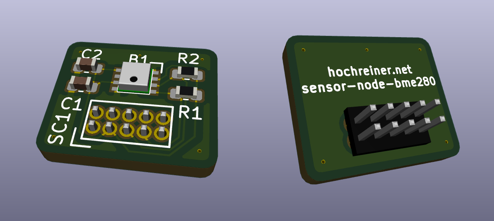

# Sensor node BME280

A breakout board for the sensor node core featuring the BME280.

## Main parts

### BME280
  * Bosch Sensortec: BME280
  * Digi-Key: [828-1063-1-ND](https://www.digikey.de/product-detail/en/bosch-sensortec/BME280/828-1063-1-ND/6136314)
  * [Datasheet](https://ae-bst.resource.bosch.com/media/_tech/media/datasheets/BST-BME280-DS002.pdf)
  * [Driver](https://github.com/BoschSensortec/BME280_driver)
  * Price: 6.61

### Connector
  * Sullins Connector Solutions: GRPB052VWVN-RC
  * Digi-Key: [S9015E-05-ND](https://www.digikey.de/product-detail/en/sullins-connector-solutions/GRPB052VWVN-RC/S9015E-05-ND/1786455)
  * [Datasheet](https://media.digikey.com/pdf/Data%20Sheets/Sullins%20PDFs/GRPB_%20_2VWVN-RC%2010954-C.pdf)
  * Price: 0.63

## Price

estimate: 10 EUR

## Size

11 mm x 13 mm (connector 2.25 mm in)
